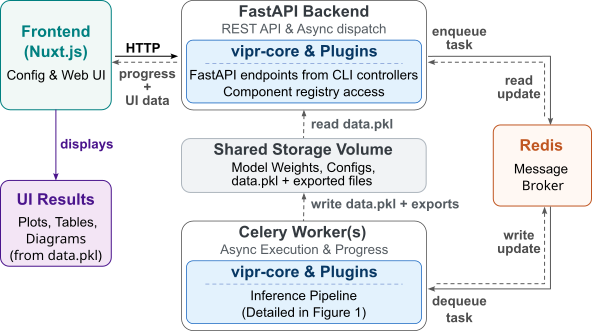

<div align="center" style="display: flex; justify-content: center; align-items: center; gap: 20px; margin-bottom: 20px;">
   </div>

## What is VIPR?
TL;DR: VIPR (Versatile Inverse Problem Software Framework) is a modular machine learning framework designed for inverse problems in physics.

Quick detail: VIPR (Versatile Inverse Problem Software Framework) is a plugin-based framework for reproducible machine-learning-driven solutions to scientific inverse problems.  It addresses ill-posed reconstruction tasks caused by loss of phase information during measurement, where direct inversion is not possible. It implements a modular microkernel architecture with domain-specific plugins to produce configurable machine learning workflows, including both deterministic and probabilistic models. Workflows are defined via declarative YAML configurations and can be executed through a command-line interface or a containerized web application. For a given experimental dataset, VIPR produces standardized analysis artifacts, including visualizations and statistical summaries.

## Repository strucure:
vipr-demonstrator has directories titled `vipr-<component>`, which are basically submodules hosted at https://codebase.helmholtz.cloud/vipr/
```
vipr-demonstrator/
├── README.md                    # This file
├── images                       # Images featured in this readme file
├── vipr-api					 # REST API backend (FastAPI) with async processing (Celery)
├── vipr-core					 # Provides fundamental infrastructure (e.g. CLI, config management, plugin ecosystem w/o domain logic).
├── vipr-frontend				 # Web interface (Nuxt.js)
├── vipr-framework               # Implements containerization of VIPR-project using docker-compose. Also features source files for the documentation hosted at (https://vipr-docs.pages.dev/) which might be of interest to developeers (and extra-keen users ;) )
└── vipr-reflectometry-plugin    # Example domain-plugin, registers domain-specific handlers, filters, and hooks with the core.
```

## Inference Pipeline (as a user)

At the core of VIPR is a domain-agnostic, graciously generic, five-step inference pipeline designed to
support reproducible scientific workflows. The pipeline ensures that
data flows through a predictable sequence of operations:

1.  :floppy_disk: **Load Data:** Experimental files (e.g., CSV, HDF5) are loaded
    and standardized into a unified `DataSet` structure containing
    input given as a vector of arguments ($x$), a mapped vector of
    values/results ($y$) optionally with uncertainties ($dx, dy$) by the corresponding file format-defined data handler.

2.  :robot: **Load Model:** A pre-trained model is loaded and prepared
    for inference on the configured device (CPU/GPU) by the model handler.

3.  :hammer_and_pick: **Preprocess:** A chain of filters transforms the `DataSet` for  model consumption. Filters are executed in deterministic
    weight-sorted order and configured via YAML, enabling operations
    such as normalization, data cleaning, outlier removal, or
    interpolation to the model's input grid.

4.  :tada: **Predict:** The model generates predictions based on the
    preprocessed input.

5. :bar_chart: **Postprocess:** Results are formatted, and hooks are triggered to generate artifacts (plots, tables) or persist results.


## Software architecture in nutshell (in the interest of developers):

VIPR is built upon the [Cement application framework](https://github.com/datafolklabs/cement/) and
[NF4IP](https://github.com/Photon-AI-Research/NF4IP). The framework uses three primary mechanisms to ensure extensibility
without modifying the core codebase:
-   **Handlers** extend handler base classes (e.g., `DataLoaderHandler`,
    `ModelLoaderHandler`, `PredictorHandler`) to implement
    domain-specific data loading, model loading, and prediction.
-   **Filters** are chainable functions that transform data passing
    through the pipeline (e.g., interpolation, normalization). They are
    executed in a deterministic, weight-sorted order.
-   **Hooks** are callbacks used for non-transforming tasks such as
    logging, validation, or real-time visualization.



### Deployment architecture


[Here](https://vipr-docs.pages.dev/) is a link to an in-depth documentation!

## Steps to reproduce the results presented in the [arXiv paper](http://arxiv.org/abs/nnnn.nnnnn) 
### Using CLI:
```text
git clone --recursive https://github.com/Photon-AI-Research/vipr_demonstrator.git
% Setup a virtual environment and install all the dependencies
cd vipr_demonstrator\vipr-api
python3 -m venv venv
source venv/bin/activate
pip install .
pip install -r requirements.txt 
%%%%%%%%%%%%%%%%%%%%
% reflectorch plugin example: deterministic workflow on experimental X-ray reflectometry data 
% (PTCDI-C3 on thin SiO~x~ on Si substrate)
vipr --config @vipr_reflectometry/reflectorch/examples/configs/PTCDI-C3.yaml inference run
% Output path: `storage/results/inference/PTCDI-C3/`
%%%%%%%%%%%%%%%%%%%%
% normalizing flow example: Probabilistic workflow on experimental neutron reflectometry data 
% (Pt/Fe MARIA dataset)
mkdir -p storage/reflectometry/flow_models/configs/ storage/reflectometry/flow_models/saved_models/
curl -L "https://codebase.helmholtz.cloud/vipr/models/reflectometry-nsf-nr-maria/-/raw/models/models/fxc34ran/config.yaml" -o storage/reflectometry/flow_models/configs/fxc34ran.yaml
curl -L "https://codebase.helmholtz.cloud/vipr/models/reflectometry-nsf-nr-maria/-/raw/models/models/fxc34ran/model.pt" -o storage/reflectometry/flow_models/configs/fxc34ran.yaml
vipr --config @vipr_reflectometry/flow_models/examples/configs/Fe_Pt_DN_NSF_fxc34ran.yaml inference run
% Output path: `storage/results/inference/PTCDI-C3/`
```

### Using VIPR Web App Without Docker
```text
% Use new terminal to install and start Redis 
cd ~
wget https://download.redis.io/redis-stable.tar.gz
tar xzf redis-stable.tar.gz
cd redis-stable
make
~/redis-stable/src/redis-server --port 6379 --daemonize yes --logfile ~/redis.log --dir ~/
% Setup a virtual environment and install all the dependencies (see above)
% In the frontend, open the examples dialog by clicking the Load Examples button.
% Load `PTCDI C3` or `fxc34ran` example
% Click run inference
% make sure to shut down Redis in the end using the following command
~/redis-stable/src/redis-cli shutdown
```

## License

This project is licensed under the GNU Lesser General Public License v3.0 or later (LGPL-3.0-or-later).

See [LICENSE.txt](framework/LICENSE.txt) for the full license text and [NOTICE.txt](framework/NOTICE.txt) for component information.

## How to Cite VIPR
If you use this code in your research, please kindly cite the following paper

```text
@article{rustamov2026vipr,
  title={VIPR: Versatile Inverse Problem Software Framework},
  author={Rustamov, Jeyhun and Creutzburg, Sascha},
  journal={arXiv preprint arXiv:nnnn.nnnnn},
  year={2026}
}
```

## Acknowledgments

This project is developed by the VIPR Project Consortium with contributions from:
- [Helm & Walter IT-Solutions GmbH](https://www.helmundwalter.de/)
- [Forschungszentrum Jülich (FZJ) - Jülich Centre for Neutron Science (JCNS)](https://www.fz-juelich.de)
- [Technische Universität München (TUM)](https://www.tum.de)
- [University of Tübingen](https://www.uni-tuebingen.de)
- [University of Siegen](https://www.uni-siegen.de)
- [Helmholtz-Zentrum Dresden-Rossendorf (HZDR)](https://www.hzdr.de)
- [DESY (Deutsches Elektronen-Synchrotron)](https://www.desy.de)

For more information, visit: https://vipr-project.de
